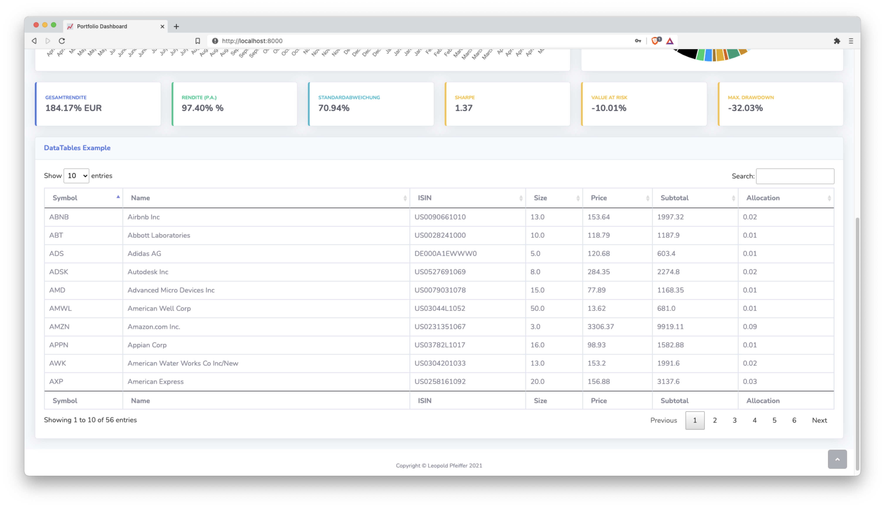

# Portfolio Dashboard
Custom Portfolio Dashboard for your Degiro account built with Django

## Getting started

### Build with docker-compose
Run

```shell
sh setup.sh
```

from the project root. This will create a `.env` file (if none exists) and builds the container.
Migrations are also applied right away and a superuser is created so that you can login.

This superuser has the credentials

```
username: admin
password: admin
```

Delete this user and create your own once you're ready.

You should now be able to access the dashboard on `localhost:8000`.


### Run without build

Alternatively, you can run the django directly without building the container. However, 
this requires to have a Postgres database running on your system. 

1. Generate `.env` file
   
You will need a `.env` file, which you can create by running

```shell
sh generate_dotenv.sh
```

and filling out the environment variables the way you need them.

2. Create a virtual environment

```shell
python -m virtualenv venv
source venv/bin/activate
```

3. Install the requirements
```shell
pip install -r requirements.txt
```

4. Run migrations and generate superuser
```shell
python manage.py migrate
python manage.py loaddata ./project/fixtures/admin.json
```

As before, the default superuser will have the credentials

```
username: admin
password: admin
```

Delete this user and create your own once you're ready.

5. Start the app
```shell
python manage.py runserver 0.0.0.0:8000
```

You should now be able to access the dashboard on `localhost:8000`.

## Loading data

If you have properly configured your Degiro credentials in the `.env` file, you can fetch your 
account data from the Degiro API by initiating an ETL process. The ETL process also collects price 
date from Yahoo finance. 

From within your container (or virtual env) run

```shell
python manage.py etl 
```

This will take a few moments (mostly due to the price data being fetched from Yahoo finance).

Once you've run the ETL process, your portfolio data is visible on the dashboard.

## Screenshots
The app contains a dashboard view for you Degiro Portfolio.



## Technologies
- [Django](https://www.djangoproject.com/) for the general project setup
- Degiro API loosely based on [this repository](https://github.com/bramton/degiro).
- [YFinance](https://github.com/ranaroussi/yfinance) to pull price data for stocks.
- PostgreSQL database for persistent storage
- [Docker Compose](https://docs.docker.com/compose/) for containerization
- [SB Admin 2](https://startbootstrap.com/theme/sb-admin-2) bootstrap template for the frontend
